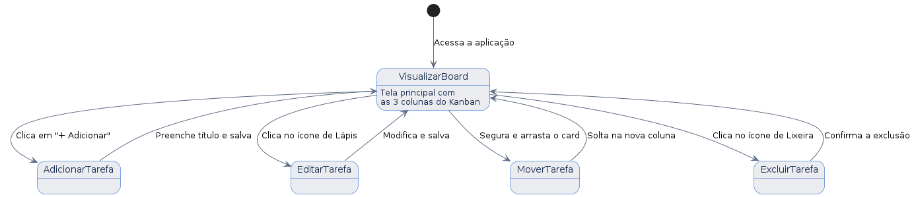
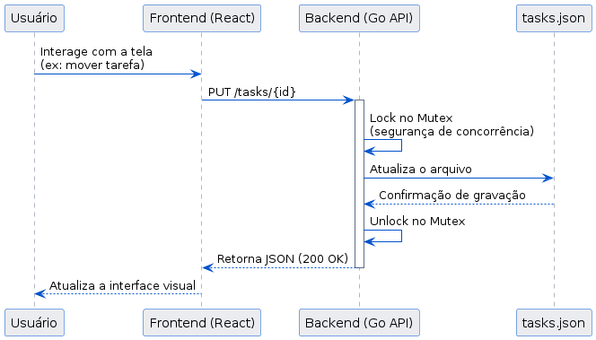

# Desafio Fullstack - Mini Kanban Veritas

Olá! Bem-vindo(a) ao meu repositório. Este é o projeto que desenvolvi para o desafio técnico da Veritas Consultoria Empresarial. 

A ideia aqui foi construir um Kanban simples, mas robusto, com três colunas fixas ("A Fazer", "Em Progresso" e "Concluídas"). Foquei bastante em entregar não só o que foi pedido, mas também uma experiência fluida para o usuário final e uma arquitetura limpa para quem for ler o código.

---

## Como rodar o projeto na sua máquina

Para facilitar a avaliação, eu coloquei toda a aplicação em containers usando o **Docker**. Isso significa que você não precisa instalar o Go, o Node ou configurar portas manualmente.

**Passo a passo:**
1. Clone este repositório para o seu computador.

2. Abra o terminal na pasta raiz do projeto.

3. Execute o comando abaixo para construir e subir as imagens:

   ```bash
   docker compose up --build

4. Aguarde a mensagem de sucesso no terminal e acesse no seu navegador:

Interface do Kanban: http://localhost:3000

API do Backend: http://localhost:8080/tasks

## Minhas Decisões Técnicas
Durante o desenvolvimento, precisei tomar algumas decisões de arquitetura e design. Aqui explico o "porquê" de cada uma:

Arquitetura em Containers Separados: Decidi criar um Dockerfile para o Go e outro para o React (usando Nginx), orquestrando tudo com o docker-compose. Fiz isso para mostrar um ambiente mais próximo do real, mantendo as responsabilidades totalmente separadas.

Persistência em JSON com Segurança: O desafio pedia armazenamento em memória com bônus para persistência. Usei o arquivo tasks.json. Para evitar dor de cabeça com leitura/escrita simultânea, implementei um sync.Mutex no Go, bloqueando o arquivo enquanto uma ação acontece.

Drag and Drop sem Bugs (Otimismo na UI): No React, usei a biblioteca @hello-pangea/dnd. A mágica aqui é a "Optimistic UI": quando você arrasta um card, a interface atualiza instantaneamente para você, enquanto o Axios avisa o backend de forma silenciosa por trás.

Modo Escuro e Flexbox: Pensei no avaliador que vai testar isso à noite! Criei um toggle de Modo Escuro/Claro e usei Flexbox para garantir que o board ocupe a tela toda no desktop e role horizontalmente no celular (estilo Trello).

Segurança Básica: Criei um middleware no backend não apenas para fazer logs bonitos no terminal, mas para injetar cabeçalhos defensivos na resposta (X-Frame-Options e X-Content-Type-Options).

## Limitações Conhecidas e Melhorias Futuras

Fui bem sincero comigo mesmo ao revisar o projeto e percebi alguns pontos que valem a pena deixar registrados, tanto por transparência quanto porque mostram que entendo o motivo de cada limitação.

**Ordenação dentro da coluna:** o backend guarda as tarefas em um `map[string]Task` no Go, e mapas não garantem ordem determinística quando são percorridos. Isso significa que mover uma tarefa entre colunas funciona perfeitamente e persiste o novo status, mas a ordem visual que você define ao arrastar as tarefas dentro da mesma coluna não é salva. Se você recarregar a página, a ordem pode aparecer diferente. Uma melhoria futura seria adicionar um campo `position` na struct `Task` para guardar essa sequência.

**URL da API fixa:** o frontend aponta direto para `http://localhost:8080/tasks`. Funciona bem no ambiente local e via Docker Compose, mas numa próxima versão eu usaria uma variável de ambiente (`VITE_API_URL`) para deixar isso mais flexível em outros ambientes.

**Sem autenticação:** a API está aberta, com CORS liberado para qualquer origem. Faz sentido para o escopo deste desafio, mas num cenário de produção real eu implementaria autenticação e autorização antes de qualquer coisa.

**Geração de ID:** optei por usar timestamp (`UnixNano`) em vez de UUID. Funciona bem na prática e simplifica o código, mas um UUID seria uma escolha mais robusta para evitar colisões teóricas em cenários de alta concorrência.

## Documentação Visual (UML)
Abaixo estão os diagramas representando o comportamento do sistema. 

### 1. User Flow


### 2. Data Flow


